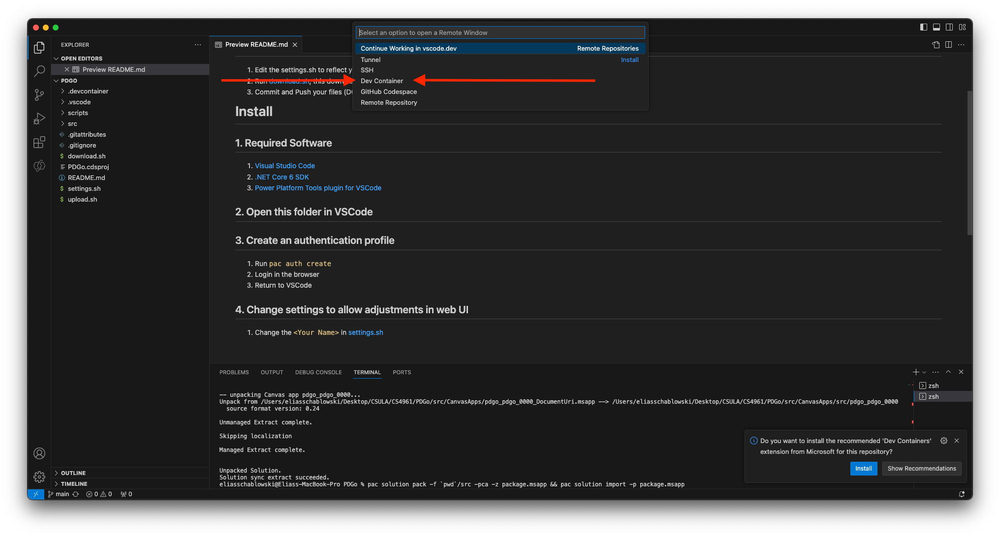

# Install
## 1. Required Software
1. [Visual Studio Code](https://code.visualstudio.com)
2. [Docker](https://www.docker.com/products/docker-desktop/)

## 2. Open this folder in VSCode

## 3. Reopen in DevContainer
1. Click the blue button on the bottom left of VSCode

2. Select the DevContainer Extension (if not installed, otherwise proceed to step 4)

3. Click the blue button on the bottom left of VSCode again

4. Select `Reopen in Container`

5. Wait for the download/install inside the container to complete
6. Select your student account (...@calstatela.edu) to log into PowerApps
7. Go back to VSCode

## 4. Change settings to allow adjustments in web UI
1. Change the `<Your Name>` in [settings.sh](./settings.sh)
2. Change the `<Some random 4 digit number - make sure you dont conflict>` to a 4 digit number that is unique to you, you should probably make a shoutout in Discord to lock your number in, otherwise if two apps share the same number, they share the changes